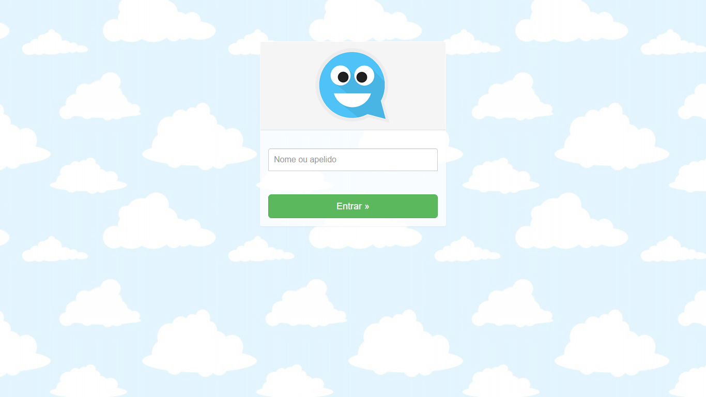
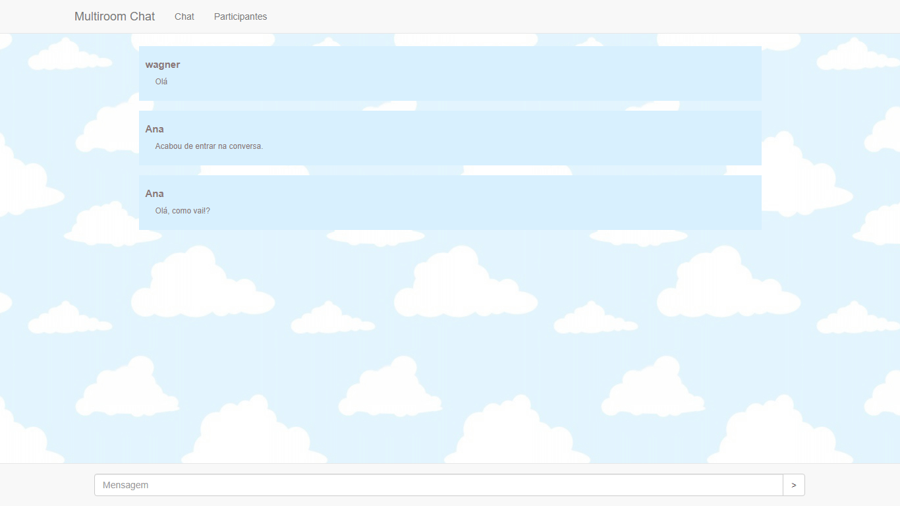
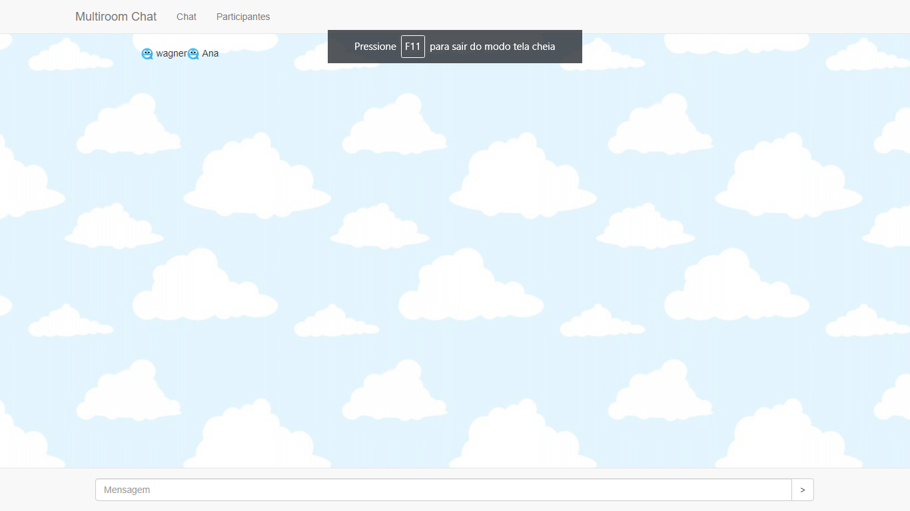

# Project Multiroom Chat

  

  

  

# What's this project

This project was used as example to learn and explore the development's concepts of creating a chat room using Node.Js and web socket. 
